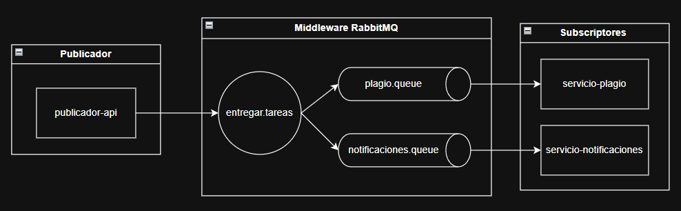
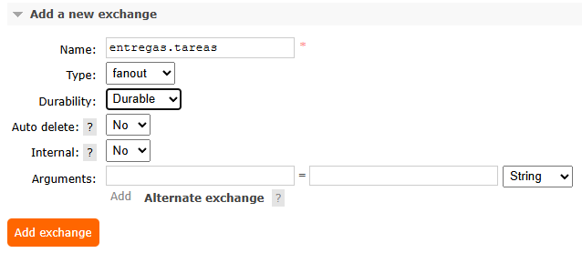
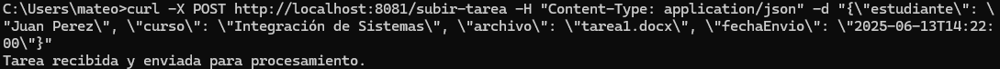
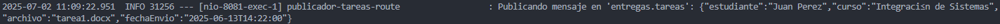

# Taller: Patrón Publicador/Suscriptor con APIs y RabbitMQ

Este proyecto implementa una solución distribuida basada en el patrón Pub/Sub para el sistema de procesamiento de tareas de la empresa ficticia StreamEdu[cite: 5, 6]. [cite_start]Utiliza Apache Camel sobre Spring Boot para la lógica de integración y RabbitMQ como middleware de mensajería.

---

## Diagrama de Arquitectura Funcional

El sistema se compone de una API REST que actúa como publicador y dos servicios independientes que actúan como suscriptores. La comunicación se desacopla a través de un exchange de tipo `fanout` en RabbitMQ, asegurando que cada tarea enviada sea procesada en paralelo por todos los servicios suscritos.



## Instrucciones para Ejecutar los Componentes

Sigue estos pasos para levantar y probar el ecosistema completo.

### Prerrequisitos
* Java 11 o superior
* Apache Maven
* Docker (o una instalación local de RabbitMQ)

### Paso 1: Levantar RabbitMQ
Abre una terminal y ejecuta el siguiente comando para iniciar un contenedor de RabbitMQ con su panel de gestión:
```bash
docker run -d --hostname my-rabbit --name rabbit-pubsub \  -p 5672:5672 -p 15672:15672 \  rabbitmq:3-management 
```
Luego, accede a `http://localhost:15672` (user: `guest`, pass: `guest`), ve a la pestaña **Exchanges** y crea manualmente un exchange de tipo **`fanout`** llamado **`entregas.tareas`**.




### Paso 2: Ejecutar los Servicios
Abre **tres terminales separadas**, una para cada servicio.

* **Terminal 1 (Servicio de Notificaciones):**
    ```bash
    cd servicio-notificaciones
    mvn spring-boot:run
    ```

* **Terminal 2 (Servicio de Plagio):**
    ```bash
    cd servicio-plagio
    mvn spring-boot:run
    ```

* **Terminal 3 (API Publicador):**
    ```bash
    cd publicador-api
    mvn spring-boot:run
    ```
Espera a que las tres aplicaciones se inicien correctamente.

### Paso 3: Probar el Sistema
Usa `curl` o una herramienta como Postman para enviar una tarea a la API del publicador.

```bash
curl -X POST http://localhost:8081/subir-tarea -H "Content-Type: application/json" -d "{\"estudiante\": \"Juan Perez\", \"curso\": \"Integración de Sistemas\", \"archivo\": \"tarea1.docx\", \"fechaEnvio\": \"2025-06-13T14:22:00\"}"
```


---

## Evidencia de Funcionamiento

A continuación se muestra la evidencia del sistema en ejecución.

### Publicador Enviando Mensaje 


### Suscriptores Recibiendo y Procesando el Mensaje

*  servicio-notificaciones


*  servicio-plagio


